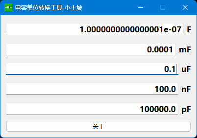
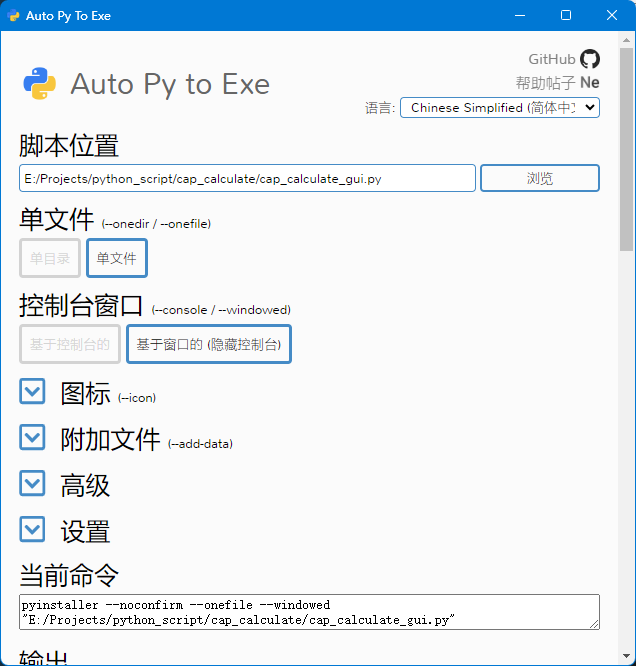

该项目是我写的一个电容单位转换工具，基于 `Python` + `PySide6` 开发，现已开发完成，在此分享出来。



界面设计使用了 Qt Designer，可以在 pyside 的安装包下找到。

运行代码的前提是你要安装 pyside6，方法为：`pip install PySide6`

我用的开发环境是 `VSCode` + `Qt for Python` 插件，`Qt for Python` 插件可以方便的将 `.ui` 和 `.qrc` 文件转换为 `.py`文件。

打包工具我使用的是 `pyinstaller` `auto-py-to-exe`

安装并运行：
```bash
pip install pyinstaller auto-py-to-exe 
auto-py-to-exe
```

